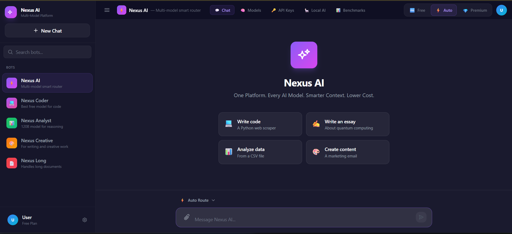
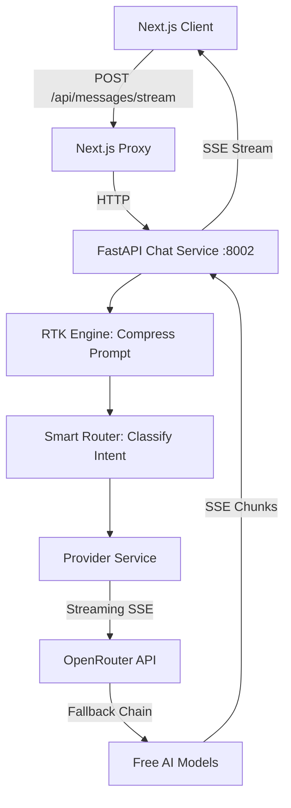

<div align="center">

# NeXus AI
### One Platform. Every AI Model. Smarter Context. Lower Cost.

[]()
[]()
[]()
[]()
[]()



</div>

NeXus AI is a production-grade, multi-model AI operating system with an integrated RTK Engine (Reduction of Tokens Kit). It automatically compresses prompts before sending them to AI providers — reducing costs by 40-60% while preserving quality. Built as a Poe-style platform, it leverages free AI models via OpenRouter, providing a unified interface for chatting, agent workflows, and model management.

---

## Core Features

- **Poe-Style Multi-Model Chat:** A unified chat interface with streaming (SSE), message history, and a model selector dropdown for 30+ free models.
- **RTK Engine (Reduction of Tokens Kit):** The core differentiator. Compresses prompts in real-time before sending them to AI providers.
  - **System Prompt Rewriting:** Condenses verbose instructions to concise form.
  - **Filler Removal:** Strips "please", "could you", "basically", etc.
  - **History Pruning:** Older messages get code blocks stripped and long content summarized.
  - **Code Block Compression:** Logs get ANSI stripped, timestamps collapsed.
  - **Large Payload Summarization:** JSON/XML >2000 chars summarized.
- **Smart Router:** Classifies user intent via regex heuristics, then selects the optimal free model (e.g., Coding -> GPT-OSS 120B, Math -> Nemotron 3 Super 120B).
- **Automatic Model Fallback:** If a model is rate-limited or unavailable, the backend automatically tries the next model in the chain (Nemotron -> GPT-OSS -> Qwen3 -> Nemotron Nano).
- **Functional Bot Sidebar:** Five specialized bots (Nexus AI, Coder, Analyst, Creative, Long) each with dedicated models and system prompts.
- **RTK Compression Toggle:** Radix UI switch with tooltip to enable/disable prompt compression on the fly.
- **Model Management Dashboard:** Browse 30+ models, manage API keys for 15 providers, and download/run local models via Ollama integration.
- **LangGraph Multi-Agent System:** Autonomous agents with web, file, code, and memory tools using Hermes tool definitions.
- **Memory & RAG:** Context management and Celery-based document processing for Retrieval-Augmented Generation.

---

## System Architecture

NeXus AI uses a Turborepo monorepo architecture to separate frontend and backend concerns.



---

## Project Structure (Monorepo)

```text
NeXus_Ai/
├── package.json                              # Root monorepo config (npm workspaces)
├── turbo.json                                # Turborepo task definitions
├── tsconfig.base.json                        # Shared TypeScript config
│
├── apps/
│   └── web/                                  # Next.js 14 Frontend
│       ├── src/
│       │   ├── app/                          # Root layout, dark theme, main page
│       │   ├── store/                        # Zustand: messages, streaming, RTK metrics
│       │   └── types/                        # TypeScript API types
│       └── components/
│           ├── chat/                         # ChatInterface, ChatMessage, PromptInput, ModelSelector, RtkToggle
│           ├── sidebar/                      # BotSidebar
│           ├── models/                       # ModeToggle, ModelCard, ModelManager, ApiKeyManager, LocalModelHub, Benchmarks
│           └── context/                      # RtkDashboardWidget
│
├── packages/
│   └── python-sdk/                           # Shared Python Code
│       └── nexus_db/
│           └── models.py                     # SQLAlchemy models
│
└── services/                                 # Python FastAPI Backend
    ├── chat/                                 # Chat Service (port 8002)
    │   ├── main.py                           # FastAPI app with CORS + SSE streaming
    │   └── core/
    │       ├── rtk_engine.py                 # Prompt compression pipeline
    │       ├── smart_route.py                # Intent classification -> model selection
    │       ├── provider_service.py           # OpenRouter streaming + fallback logic
    │       ├── model_registry.py             # 30+ model catalog metadata
    │       └── model_api.py                  # Model/Provider REST endpoints
    │
    ├── agents/                               # LangGraph Multi-Agent System
    ├── memory/                               # Memory & Context Management
    └── knowledge/                            # RAG & Celery Document Processing
```

---

## How the RTK Engine Works

The RTK Engine compresses prompts before sending them to AI providers. Token savings grow with conversation length:

- **Turn 1:** ~10% savings (system prompt compression)
- **Turn 3:** ~7% savings (history pruning kicks in)
- **Turn 6+:** ~34% savings (full compression pipeline active)

---

## Smart Router & Fallback Logic

**Intent Classification:**

| Intent | Model | Why |
|--------|-------|-----|
| default | `google/gemma-4-31b-it:free` | Fast, general-purpose |
| coding | `openai/gpt-oss-120b:free` | Strong code generation |
| math | `nvidia/nemotron-3-super-120b-a12b:free` | 120B parameter reasoning |
| creative | `google/gemma-4-31b-it:free` | Natural language generation |

**Automatic Fallback Chain:**
If a model is rate-limited, the system automatically tries:
`Requested Model` -> `Nemotron 3 Super 120B` -> `GPT-OSS 120B` -> `Qwen3 80B` -> `Nemotron Nano 9B`

---

## Getting Started (Local Development)

### Prerequisites
- Node.js 18+
- Python 3.11+
- An OpenRouter API key (free tier works)

### 1. Install Dependencies

**Frontend:**
```bash
cd apps/web
npm install
```

**Backend:**
```bash
cd services/chat
pip install fastapi uvicorn tiktoken pydantic openai python-dotenv httpx
```

### 2. Configure API Key
Create a `.env` file in `services/chat/.env`:
```env
OPENROUTER_API_KEY=sk-or-v1-your-key-here
```

### 3. Run the Platform

**Backend (port 8002):**
```bash
cd services/chat
python -m uvicorn main:app --port 8002
```

**Frontend (port 3000):**
```bash
cd apps/web
npx next dev
```

Visit `http://localhost:3000` and start chatting.

---

## Application Pages

| Page | Route | Description |
|------|-------|-------------|
| Chat | `/` | Main AI chat with streaming, model selector, RTK widget |
| Models | Nav tab | Browse 30+ models with search, filter, sort |
| API Keys | Nav tab | Add/manage keys for 15 AI providers |
| Local AI | Nav tab | Download/run local models via Ollama |
| Benchmarks | Nav tab | Side-by-side model comparison |

---

## Tech Stack

| Layer | Technology |
|-------|------------|
| Frontend | Next.js 14, React 18, TypeScript, Tailwind CSS, Zustand, Radix UI |
| Backend | Python 3.13, FastAPI, SSE streaming |
| AI Provider | OpenRouter API (free models: Gemma, Nemotron, GPT-OSS) |
| Compression | RTK Engine (custom prompt compression pipeline) |
| Monorepo | Turborepo, npm workspaces |

---

## License

This project is licensed under the MIT License - see the `LICENSE` file for details.
